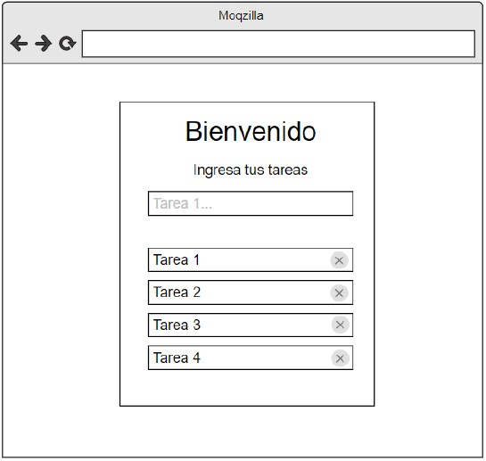

# Ejercicios React - Rolling Code School 
Prácticas con componentes, ciclo de vida del componente, eventos etc.

## Ejercicio N°4: Lista de tareas - Dificultad: 🟢

Crear una aplicación web que muestre una lista de tareas, al ingresar una tarea
en el input y presionar enter, esta tarea se debe mostrar en una lista como la
imagen a continuación:

 

### Link de Deploy:
- [Netlify](https://lucasecapdevila-tpn4react76i.netlify.app/)